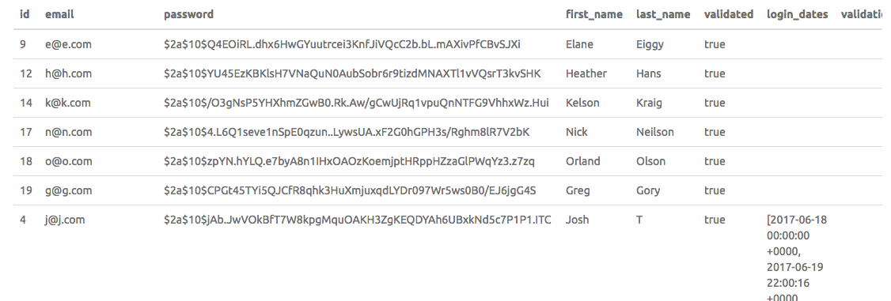

# Opus Assignment

User Administration application using Angular 2, NodeJs, Express, and ElephantSQL

## Getting Started

These instructions will get you a copy of the project up and running on your local machine.

### Prerequisites

What's needed to install and run the project

```
NodeJs
.env file that was sent in the email with the link to this repository
```

### Installing


Clone the repository

```
Clone the repository to your local machine and copy .env file to root directory (next to the index.js file)
```

Install Packages

```
npm install
```

Start server

```
npm start 

Wait until you see "Listening on port 6060"
```

Open it in chrome (or your browser of choice - I used chrome)

```
http://localhost:6060/#/
```

## A Couple Things to Note:

* Why I Used SendGrid - I tried to set up an account with PostMark, but they required a private email address. I only have public gmail and hotmail ones. So I contacted Liisa and she recommended I integrate a different email service into my project. I chose sendGrid because it seemed similar to PostMark (I also have never used it before). I still created a PostMark controller that could be used if there was an api key connected to it.

* Sending Emails - I tested the email service with my gmail and hotmail accounts. It works with both, but I did notice that the emails are recieved much faster with gmail. My hotmail account will recieve the emails, but it tends to be a couple minutes after they are sent and they end up in the spam folder. 

* Database - I thought the best way to demonstrate my understanding of building a full stack application would be to do just that - build a full stack application. So, I decided to host my database rather than just use a JSON file (also, it was free). I populated the database with a lot of dummy data (for example: a@a.com, j@j.com, etc). The database has 8 columns: id (primary key), email, password (hashed and salted using bcrypt), first_name, last_name, validated (true/false), validation_token, and login_dates (array of timestamps). 



* Please either log out or switch browsers when adding a user and then following the validation link. The authentication cookie and user id will not change to the correct user if the same browser window is used. I feel comfortable requesting this because in the real world Person A would add Person B and then Person B would have to go to their own email most likely on a different machine to follow the link and set their password.

## How It Works

* Registering a new account - A user enters in their information on the register screen. The information is sent to the server where it checks to make sure the email doesn't already exist. It then hashes and salts the password and adds the information to the database (it also sets validated to false). A random token is generated and sent in a url link in an email to the new user. When clicked a new tab is opened and the token is taken from the url and sent to the server. The server searches the database for that token and sets validated to true, then automatically logs the user in. The user cannot log in until they are validated. 

* Reseting a password - The user clicks on the Forgot Password link on the login screen and they are redirected to the forgot password screen where they enter their email. That email address is sent to the server where it generates and sets in the database a new validation token. It then sends an email with that validation token url link to the user. When clicked it opens a new tab, validates the user based on the token in the url, and redirects them to the reset password screen. If the passwords entered there match and are at least 8 characters in length they are sent to the database and a confirmation email is sent to the user. The user is then automatically logged in.

* Adding a new user - Person A adds Person B's email, first name, and last name into the add user modal on the dashboard. The information is then sent to the database where it is populated. A random token is generated and sent in a url to Person B's email. This email states that they have been added and asks that they follow the url to set a password. When clicked the token in the url is validated with the one stored in the database and Person B is redirected to the set password screen. Once they submit the password, it is stored in the database and they are automatically logged in. 

## Built With

* [Angular.io](https://angular.io/) - Front-End Framework
* [ExpressJS](https://expressjs.com/) - Back-End Node Framework
* [JSON Web Tokens](https://jwt.io/) - Authentication Tokens
* [HandleBars](https://www.npmjs.com/package/handlebars) - HandlesbarsJS npm Package
* [ElephantSQL](https://www.elephantsql.com/) - Hosted Database
* [SendGrid](https://sendgrid.com) - Email Transport System
* [PostMark](https://postmarkapp.com/) - Email Transport System
